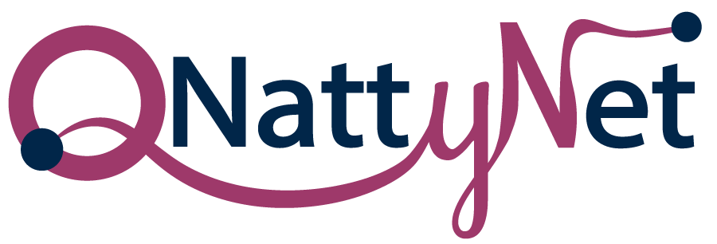
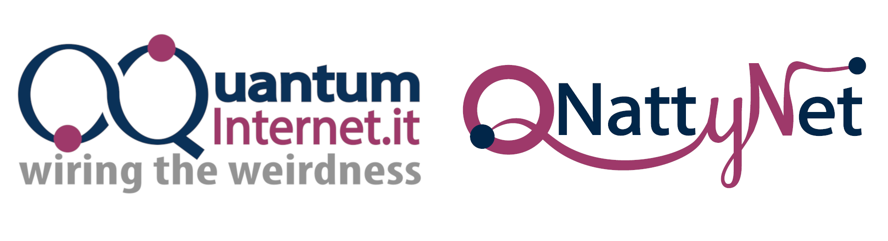
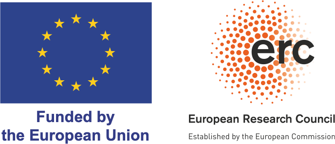

<p align="center">
  <a href="https://qnattynet.quantuminternet.it/"></a>
</p>

<p align="center">
  <a href="https://github.com/QuantumInternet-it/q2ns/blob/main/LICENSE"> </a>
  <!--  <a href="https://arxiv.org/abs/2603.02857"></a>  -->
  <a href="https://doi.org/10.5281/zenodo.19370945"></a>
  <a href="https://www.nsnam.org/"></a>
  <a href="https://quantuminternet-it.github.io/q2ns/"></a>
</p>

# Q2NS - An Extensible Quantum Network Simulator Built on ns-3

**Q2NS** is a modular, inherently extensible simulation framework for quantum networks, built on top of [ns-3](https://www.nsnam.org/). **Q2NS** augments ns-3 with quantum-network primitives while remaining fully compatible with ns-3’s classical discrete-event simulation environment. The goal is to provide a flexible, open, and scalable platform for Quantum Internet research.

**Q2NS**'s design reflects recent advances in quantum-native network architectural modeling [(1)](https://ieeexplore.ieee.org/document/11322738). The “2” in **Q2NS** is intentional and applies to both **Q** and **N**: **Q2** captures quantumness at the message and control functionality levels, while **2N** reflects the enforced decoupling between network control and in-network operation execution within a unified framework [(1)](https://ieeexplore.ieee.org/document/11322738).

As described in [our paper](https://arxiv.org/abs/2603.02857), users build a network with `NetController`, then create, manipulate, and send qubits through `QNode`. This allows for a decoupling of protocol control logic from node- and channel-level operations, enabling rapid prototyping and adaptation across heterogeneous and evolving Quantum Internet scenarios. **Q2NS** also natively supports multiple quantum-state representations through a unified plug-in interface, allowing interchangeable state-vector, density-matrix, and stabilizer backends.

This repository additionally includes **q2nsviz** (Q2NSViz), a lightweight visualization companion for trace-based animations. It jointly renders physical- and entanglement-connectivity graphs and supports entangled-state manipulations, facilitating an intuitive inspection of entanglement dynamics and protocol behavior. More details can be found in our documentation and related works!

**Q2NS** is developed within the [ERC-CoG QNattyNet](https://qnattynet.quantuminternet.it/) project (grant n. 101169850) at the [University of Naples Federico II](https://www.unina.it/), funded by the European Research Council.

<p align="center">
  <a href="https://quantuminternet-it.github.io/q2ns/">
    
  </a>
</p>

## Key Features

- **Multiple quantum state backends** — ket-vector (`QStateBackend::Ket`), density matrix (`DM`), and stabilizer (`Stab`) representations, selectable per simulation at runtime.
- **QMap-based channel noise** — composable channel noise models including `DepolarizingQMap`, `DephasingQMap`, `LossQMap`, `RandomGateQMap`, `RandomUnitaryQMap`, plus `LambdaQMap` for arbitrary custom maps.
- **Native ns-3 integration** — standard `build_lib` module structure; `NS_LOG`, `TypeId` attributes, helper classes, examples, and tests follow ns-3 conventions throughout.
- **Classical–quantum co-simulation** — inherits the full ns-3 networking stack; classical and quantum traffic coexist over the same simulated topology with accurate timing and congestion effects.
- **q2nsviz companion** — lightweight trace-based browser visualization for quantum network animations.

> [!NOTE]
> Q2NS has been tested and is recommended for use with **ns-3.47**. Other versions may require minor adjustments.

## Getting Started

### 1. Clone ns-3 and add Q2NS

```bash
git clone https://gitlab.com/nsnam/ns-3-dev.git
cd ns-3-dev
git checkout ns-3.47 # recommended

git clone https://github.com/QuantumInternet-it/q2ns.git contrib/q2ns
```

### 2. Configure and build

```bash
./ns3 configure --enable-examples --enable-tests
./ns3 build
```

### 3. Run an example

```bash
./ns3 run q2ns-1-basics-example
```

To write a custom simulation, create a `.cc` file in `scratch/`, e.g. `scratch/q2ns-custom-sim.cc`.
This pattern mirrors the included `examples/q2ns-1-basics-example.cc`:

```cpp
#include "ns3/core-module.h"
#include "ns3/q2ns-netcontroller.h"
#include "ns3/q2ns-qgate.h"
#include "ns3/q2ns-qnode.h"
#include "ns3/q2ns-qstate.h"

using namespace ns3;
using namespace q2ns;

int main() {
    RngSeedManager::SetSeed(42);
    RngSeedManager::SetRun(1);

    NetController net;
    net.SetQStateBackend(QStateBackend::Ket);

    auto node = net.CreateNode();
    auto q = node->CreateQubit();

    Simulator::Schedule(MicroSeconds(10), [node, q]() {
        node->Apply(gates::H(), {q});
        std::cout << "State after H: " << node->GetState(q) << "\n";
    });

    Simulator::Schedule(MicroSeconds(20), [node, q]() {
        int result = node->Measure(q);
        std::cout << "Measurement result: " << result << "\n";
    });

    Simulator::Stop(MilliSeconds(10));
    Simulator::Run();
    Simulator::Destroy();
    return 0;
}
```

Then run it with:

```bash
./ns3 run scratch/q2ns-custom-sim
```

If you encounter build issues, run `./ns3 build` first to ensure everything is compiled.

## System Requirements

- ns-3 (tested with `ns-3.47`)
- C++23 compiler (GCC >= 11 / Clang >= 17)
- CMake >= 3.20
- Python 3 (for the q2nsviz visualization server)

### Third-Party Dependencies

This project vendors a small set of third-party libraries under `third_party/` to ensure reproducible builds and avoid dependency drift. This currently includes Eigen, qpp, qasmtools, and stab.

For full details on versions, licensing, and any local modifications, see: [`third_party/THIRD_PARTY.md`](third_party/THIRD_PARTY.md)

## Visualization (q2nsviz)

Q2NS can emit **trace files** (`.json` / `.ndjson`) that can be loaded and animated in a browser.

### 1. Generate a trace

Run a visualization-enabled example:

```bash
./ns3 run q2nsviz-teleportation-example
```

This produces a file such as `examples/example_traces/q2nsviz-teleportation-example.json`.

### 2. Start the viewer

From the ns-3 root:

```bash
./tools/q2nsviz/q2nsviz-serve.sh
```

Then open:

```
http://localhost:8000/tools/q2nsviz/viewer.html
```

### 3. Load a trace

- **Load Examples** — browse built-in traces
- **Choose local…** — load a local file manually
- or drag-and-drop a trace file directly into the viewer

## Contributors & Supporters

Q2NS is developed by our [Quantum Internet Research Group](https://qnattynet.quantuminternet.it/) team, under the [ERC-CoG QNattyNet](https://www.quantuminternet.it/qnattynet/) project.

Thank you to all the researchers who have helped develop Q2NS!

<p align="center">
  <a href="https://github.com/QuantumInternet-it/q2ns/graphs/contributors">
    
  </a>
</p>

Q2NS is and will remain free, open-source software.
We are committed to keeping it open and actively maintained for the quantum networking research community.

To support this endeavor, please consider:

- Starring and sharing the repository: https://github.com/QuantumInternet-it/q2ns
- Contributing code, documentation, tests, or examples via issues and pull requests
- Citing Q2NS in your publications (see [Cite This](#cite-this))
- Sharing feedback and use cases with the team

## Cite This

If you use Q2NS in your research, please cite our reference paper:
[_An Extensible Quantum Network Simulator Built on ns-3: Q2NS Design and Evaluation_](https://arxiv.org/abs/2603.02857) — [PDF](https://arxiv.org/pdf/2603.02857)

You can use the GitHub **“Cite this repository”** button (top-right of this page) for a ready-to-use citation in multiple formats, or use the BibTeX entry below:

```bibtex
@misc{q2ns-journal-2026,
  title         = {An Extensible Quantum Network Simulator Built on ns-3: Q2NS Design and Evaluation},
  author        = {Adam Pearson, Francesco Mazza, Marcello Caleffi, Angela Sara Cacciapuoti},
  year          = {2026},
  eprint        = {2603.02857},
  archivePrefix = {arXiv},
  primaryClass  = {quant-ph},
  url           = {https://arxiv.org/abs/2603.02857}
}
```

## Related Publications

The following papers use, build, or motivate Q2NS. If your work belongs here, please open an issue or pull request.

[[1]](https://ieeexplore.ieee.org/document/11322738) _Quantum Internet Architecture: Unlocking Quantum-Native Routing via Quantum Addressing (invited paper)_. Marcello Caleffi and Angela Sara Cacciapuoti -- in IEEE Transactions on Communications, vol. 74, pp. 3577-3599, 2026.

[[2]](https://arxiv.org/abs/2603.02857) _An Extensible Quantum Network Simulator Built on ns-3: Q2NS Design and Evaluation_. Adam Pearson, Francesco Mazza, Marcello Caleffi, Angela Sara Cacciapuoti -- 2026.

[[3]](https://doi.org/10.5281/zenodo.18980972) _Q2NS: A Modular Framework for Quantum Network Simulation in ns-3 (invited paper)_. Adam Pearson, Francesco Mazza, Marcello Caleffi, Angela Sara Cacciapuoti -- Proc. of QCNC 2026.

[4] _Q2NS Demo: a Quantum Network Simulator based on ns-3_. Francesco Mazza, Adam Pearson, Marcello Caleffi, Angela Sara Cacciapuoti -- 2026.

<!-- Add further entries in the format above as new papers appear. -->

## Acknowledgements

This work has been funded by the **European Union** under Horizon Europe ERC-CoG grant **QNattyNet**, n.101169850. Views and opinions expressed are however those of the author(s) only and do not necessarily reflect those of the European Union or the European Research Council Executive Agency. Neither the European Union nor the granting authority can be held responsible for them.

<p align="center">
  <a href="https://qnattynet.quantuminternet.it/">
    
  </a>
  &nbsp;&nbsp;&nbsp;&nbsp;
  
  &nbsp;&nbsp;&nbsp;&nbsp;
  
</p>

<br><br>

---

**License**: This project is licensed under the GNU General Public License v2.0 only (GPL-2.0-only). See the `LICENSE` file for details. This project includes third-party libraries under their respective licenses (e.g., MIT, MPL-2.0). See `third_party/THIRD_PARTY.md` for details.
